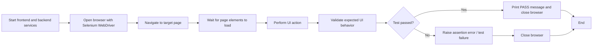

# VenueHub Selenium UI Tests

## Purpose

This document describes the Selenium-based UI tests implemented for VenueHub.

In this context, **UI tests** means brower-level validation of integrated frontedn behavior.
These tests focus on key user-visible workflows across the landing page and venue detail page, and in some cases depend on backend-provided data.

## Prerequisites
- Install Python dependencies:
  - `pip3 install selenium`
- Start the frontend locally:
  - `cd frontend`
  - `npm run dev`
- Make sure the backend is also running if you want to test search results, sorting behavior, or other API-driven features.
  - `uvicorn api.main:app --reload`
  - `http://127.0.0.1:8000/docs`

## Scope

The current Selenium UI test suite validates:

- landing page rendering
- discover section visibility
- search input interaction
- landing-page sorting behavior
- navigation from the landing page to venue details
- review section visibility on venue details pages
- review content visibility
- review sorting and filtering controls
- write-review entry points
- write-review form rendering
- 3D venue-view entry
- chat widget entry
- anonymous-state auth button visibility
- login requirement for posting a review
- add-photos control availability
- return navigation from venue details to the venue listing flow

## Preconditions

Before running the Selenium UI tests:

- the frontend is running at `http://localhost:8080`
- Chrome browser and a compatible Selenium WebDriver are installed
- the backend is running for API-driven UI features
- seeded venue and review data are available for venue detail page checks
- the hard-coded venue ID used by several venue-detail tests exists in the environment

## UI Test Workflow




## Execution Commands
Run each Selenium test individually from the project root:

```bash
python3 tests/selenium/test_homepage.py
python3 tests/selenium/test_discover_section.py
python3 tests/selenium/test_search_input.py
python3 tests/selenium/test_sort_dropdown.py
python3 tests/selenium/test_venue_details_navigation.py
python3 tests/selenium/test_reviews_section.py
python3 tests/selenium/test_review_content.py
python3 tests/selenium/test_review_sort_dropdown.py
python3 tests/selenium/test_review_section_filter.py
python3 tests/selenium/test_write_review_button.py
python3 tests/selenium/test_open_write_review_form.py
python3 tests/selenium/test_3d_view_open.py
python3 tests/selenium/test_chat_widget.py
python3 tests/selenium/test_auth_buttons.py
python3 tests/selenium/test_post_review.py
python3 tests/selenium/test_add_photos_button.py
python3 tests/selenium/test_back_to_venues.py
```

## Test Inventory

| System Test ID | Selenium File | Scenario | Primary Requirement IDs |
|---|---|---|---|
| SYS-01 | `test_homepage.py` | Homepage loads successfully | FR-2, NFR-1 |
| SYS-02 | `test_discover_section.py` | Discover section and controls render | FR-2, NFR-1 |
| SYS-03 | `test_search_input.py` | Search input accepts user input | FR-2 |
| SYS-04 | `test_sort_dropdown.py` | Landing-page sort dropdown updates | FR-2 |
| SYS-05 | `test_venue_details_navigation.py` | View Details navigates to venue page | FR-2, FR-3 |
| SYS-06 | `test_reviews_section.py` | Venue review section is visible | FR-3 |
| SYS-07 | `test_review_content.py` | Review content is visible on venue page | FR-3 |
| SYS-08 | `test_review_sort_dropdown.py` | Venue review sort control updates | FR-3 |
| SYS-09 | `test_review_section_filter.py` | Venue review section filter updates | FR-3 |
| SYS-10 | `test_write_review_button.py` | Write Review CTA is visible | FR-4 |
| SYS-11 | `test_open_write_review_form.py` | Write Review form opens and key inputs render | FR-4 |
| SYS-12 | `test_3d_view_open.py` | 3D venue view opens from venue page | FR-3 |
| SYS-13 | `test_chat_widget.py` | Chat widget opens with input and send action | FR-11 |
| SYS-14 | `test_auth_buttons.py` | Sign in and Sign up buttons show in anonymous state | FR-1 |
| SYS-15 | `test_post_review.py` | Posting a review requires login | FR-1, FR-4 |
| SYS-16 | `test_add_photos_button.py` | Add Photos control can be used in the write-review form | FR-4 |
| SYS-17 | `test_back_to_venues.py` | Back to venues link returns user to venue listing flow | FR-2, FR-3 |

## Detailed UI Test Cases

### SYS-01 Homepage loads successfully

**Objective:**  
Verify that the application root loads and renders successfully in the browser.

**Expected result:**  
The homepage is reachable and visible.

---

### SYS-02 Discover section and controls render

**Objective:**  
Verify that the main discover section is visible and includes its core controls.

**Expected result:**  
The discover section renders with expected UI elements.

---

### SYS-03 Search input accepts user input

**Objective:**  
Verify that the landing-page search input is interactive.

**Expected result:**  
The search input accepts and retains typed text.

---

### SYS-04 Landing-page sort dropdown updates

**Objective:**  
Verify that the landing-page sort control opens and changes state when a new option is selected.

**Expected result:**  
The sort control updates successfully in the UI.

---

### SYS-05 View Details navigates to a venue page

**Objective:**  
Verify that a venue card or **View Details** CTA can navigate the user to a venue details page.

**Expected result:**  
The user reaches a venue details page successfully.

---

### SYS-06 Venue review section is visible

**Objective:**  
Verify that the venue details page includes a customer review section.

**Expected result:**  
The review section is present and visible.

---

### SYS-07 Review content is visible on the venue page

**Objective:**  
Verify that existing review content is rendered on the venue details page.

**Expected result:**  
At least one review entry renders meaningful content.

---

### SYS-08 Venue review sort control updates

**Objective:**  
Verify that the review sort control on the venue page opens and switches to a different value.

**Expected result:**  
The review sort state updates successfully.

---

### SYS-09 Venue review section filter updates

**Objective:**  
Verify that the venue-page review section filter opens and applies a new value.

**Expected result:**  
The review section filter can be changed through the UI.

---

### SYS-10 Write Review button is visible

**Objective:**  
Verify that the **Write a Review** call-to-action exists on the venue page.

**Expected result:**  
The write-review entry point is visible to the user.

---

### SYS-11 Write Review form opens and inputs render

**Objective:**  
Verify that the write-review form opens and exposes key form controls.

**Expected result:**  
The review-entry form opens and its essential inputs render correctly.

---

### SYS-12 3D venue view opens

**Objective:**  
Verify that the 3D venue-view workflow can be opened from the venue details page.

**Expected result:**  
The 3D venue-view experience opens successfully.

---

### SYS-13 Chat widget opens with message controls

**Objective:**  
Verify that the chat widget opens and exposes its basic message controls.

**Expected result:**  
The chat widget opens and displays message input and send controls.

---

### SYS-14 Sign in and Sign up buttons render for anonymous users

**Objective:**  
Verify that anonymous users can see the **Sign in** and **Sign up** entry points in the header.

**Expected result:**  
Both auth buttons render correctly in anonymous state.

---

### SYS-15 Posting a review requires login

**Objective:**  
Verify that an unauthenticated user cannot submit a review without logging in.

**Expected result:**  
Attempting to post a review triggers a login requirement message.

---

### SYS-16 Add Photos control can be used in the write-review form

**Objective:**  
Verify that the **Add Photos** control is available and usable within the write-review form.

**Expected result:**  
The **Add Photos** control is visible and its file-input interaction is available.

---

### SYS-17 Back to venues link returns user to venue listing flow

**Objective:**  
Verify that the **Back to venues** link on the venue details page navigates the user away from the current venue detail route.

**Expected result:**  
The user exits the venue details page and returns to the venue listing flow.

## Notes
- The frontend runs locally at http://localhost:8080
- Some tests depend on backend data being available
- Run all tests from the project root directory
- Most venue-details-related tests use a direct venue URL to avoid flaky navigation during repeated runs